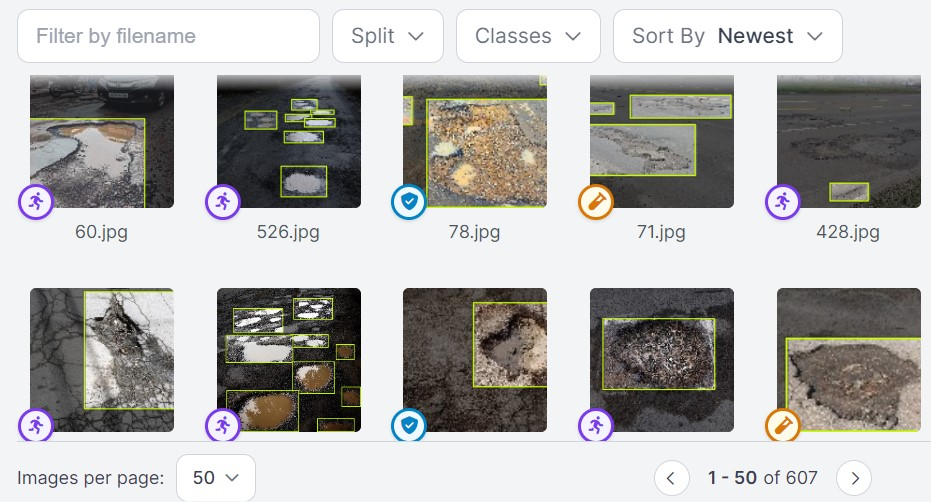
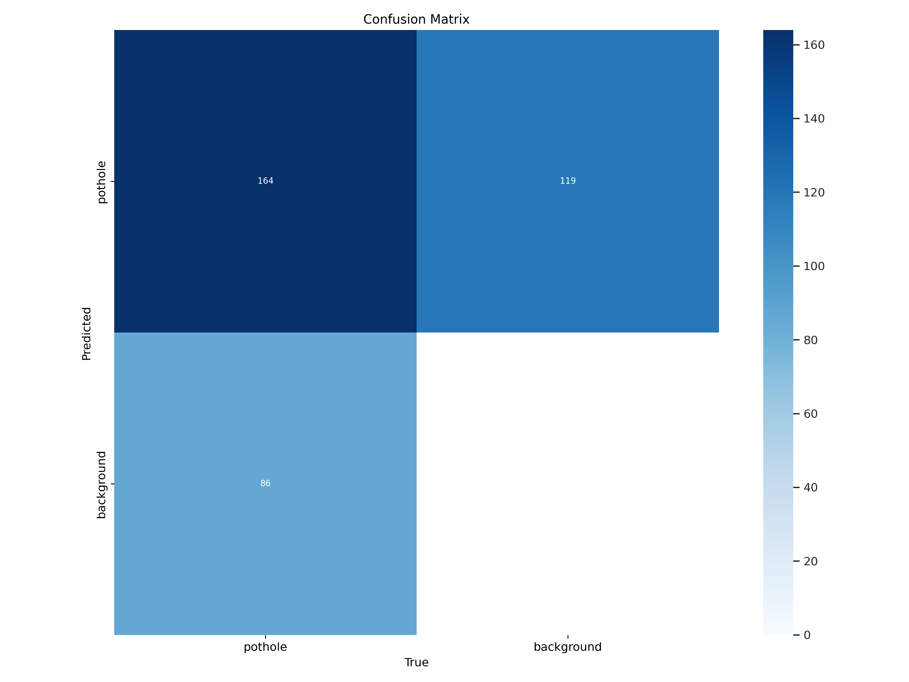

# Pothole Detection on Roads

## Project Overview
- Used a YOLOv8 model to detect potholes on roads using annotated images for training.
- Tested the model for accuracy and applied it to real-time video footage to identify potholes effectively.
- The application aims to improve road safety and maintenance by enabling real-time monitoring for autonomous vehicles and road maintenance systems.

## Motivation
The detection of potholes on roads is critical for ensuring road safety and timely maintenance. Autonomous vehicles and road maintenance systems can benefit from real-time monitoring to avoid accidents and plan repairs. This project aims to provide a robust solution for detecting potholes using advanced deep-learning techniques.

## Code and Resources Used
- **Python Version**: 3.8
- **Packages**: ultralytics, opencv, numpy, torch, matplotlib
- **Requirements**: `pip install -r requirements.txt`
- **YOLOv8**: [YOLOv8 Documentation](https://github.com/ultralytics/yolov8)
- **Project Write-Up**: Detailed project steps and findings can be found in the provided notebook and additional documentation.

## Data Collection
I annotated the images on [Roboflow](https://app.roboflow.com/jude-h0f2m/pothole-detection-yolov8-jnw3f/deploy) to train the model. The original images can be found on [Kaggle](https://www.kaggle.com/).

## EDA
Exploratory Data Analysis included:
- Visualization of annotated images to understand the distribution and variety of potholes.
- Analysis of image quality and annotation accuracy.
- Assessment of different road conditions and potholes in various scenarios.

## Preprocessing and Feature Engineering
- Images were preprocessed to standardize size and format.
- Data augmentation techniques were applied to increase the diversity of training samples.
- Specific features related to pothole shapes and sizes were engineered to enhance model performance.

## Model Performance
The YOLOv8 model was evaluated on a test set of annotated images:
- High accuracy in detecting potholes with minimal false positives and effectively identified the majority of potholes with few false negatives.
- The model demonstrated robustness across various road conditions and lighting scenarios.

## Model Explainability
- Used visualization tools to interpret the model's detection capabilities.
- Analyzed which features and aspects of the images were most influential in detecting potholes.
- Identified key factors contributing to successful detections and areas for improvement.

## Model Application
Here's a video demonstrating the model applied to real-time video footage:

